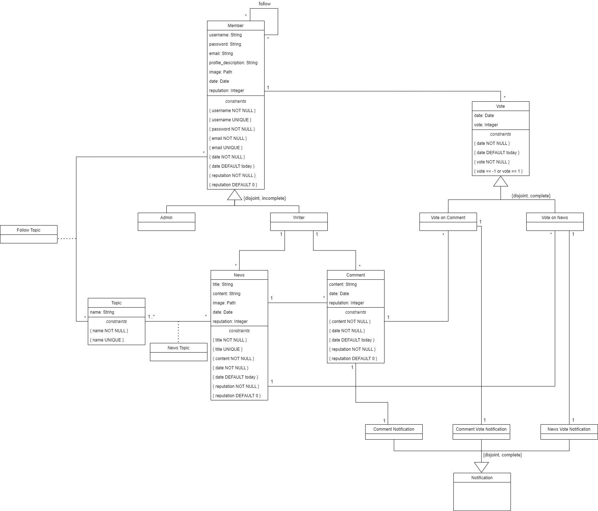

# EBD: Database Specification Component

Collaborative News is a web platform for news sharing where you can also interact with other users.

## A4: Conceptual Data Model

The purpose of this Conceptual Data Model is to provide a high level view of the static aspects and structures of our application. It shows the classes of our system and the main relationships between them. It's usefull when implementing other aspects of the system, such as the database and during it's inception system flaws can be discovered and corrected.

### 1. Class diagram



Figure 1: Collaborative News conceptual data model in UML.

### 2. Additional Business Rules

* BR01. When user account is deleted, shared user data (news items, comments and votes) is kept but is made anonymous
* BR02. User reputation depends on the upvotes and downvotes received on his posts or comments
* BR03. A post or comment cannot be deleted if it has votes or comments
* BR04. The date of a comment or a vote on a post must be greater than the item it refers to (Comment.date > News.date, VoteOnNews.date > News.date, VoteOnComment.date > Comment.date)
* BR05. A user can´t vote on his own posts or comments but he can comment his own news items
* BR06. A writer has to have at least one comment or news
* BR07. A user can't vote twice on an item
* BR08. An item's reputation is the sum of votes for that item (News.reputation = SUM(VoteOnNews.vote), Comment.reputation = SUM(VoteOnComment.vote))

---


## A5: Relational Schema, validation and schema refinement
The goal of the Relational Schema is to represent the data to be entered into the database and describe how that data is structured in tables.
The tables are constructed properly and efficiently each representing a single subject and keeping redundant data to an absolute minimum while ensuring data integrity and suporting business rules.

### 1. Relational Schema

For the <ins>vote</ins> generalization, the best option is to use the Object-oriented strategy and eliminate the relation for the superclass.
For the <ins>notification</ins> generalization, the best option is to use nulls.

| Relation reference | Relation Compact Notation                        |
| ------------------ | ------------------------------------------------ |
| R01                | member(<ins>id_member</ins>, username **UK NN** , password **NN**, email **UK NN**, profile_description, image **UK**, date **NN DF** Today, reputation **NN DF** 0, is_admin **NN**) |
| R02                | news(<ins>id_news</ins>, writer -> member, title **UK NN**, content **NN**, image **UK**, date **NN DF** Today, reputation **NN DF** 0) |
| R03                | comment(<ins>id_comment</ins>, writer -> member, news -> news, content **NN**, date **NN DF** Today, reputation **NN DF** 0) |
| R04                | follow_member(<ins>follower</ins> -> member, <ins>followed</ins> -> member) |
| R05                | topic(<ins>id_topic</ins>, name **UK NN**) |
| R06                | news_topic(<ins>news</ins> -> news, <ins>topic</ins> -> topic) |
| R07                | follow_topic(<ins>member</ins> -> member, <ins>topic</ins> -> topic) |
| R08                | vote_on_news(<ins>member</ins> -> member, <ins>news</ins> -> news, vote **NN CK** vote = 1 OR vote = -1, date **NN DF** Today) |
| R09                | vote_on_comment(<ins>member</ins> -> member, <ins>comment</ins> -> comment, vote **NN CK** vote = 1 OR vote = -1, date **NN DF** Today) |
| R10                | notification (<ins>id_notification</ins>, comment -> comment, vote_on_news -> vote_on_news, vote_on_news_author -> vote_on_news, vote_on_comment -> vote_on_comment, vote_on_comment_author -> vote_on_comment, notified_user -> member **NN**) |

Legend:
* UK = UNIQUE KEY
* NN = NOT NULL
* DF = DEFAULT
* CK = CHECK

### 2. Domains

| Domain Name | Domain Specification           |
| ----------- | ------------------------------ |
| Today	      | DATE DEFAULT CURRENT_DATE      |

### 3. Schema validation

| **TABLE R01**   | member               |
| --------------  | ---                |
| **Keys**        | { id_member }, { username }, { email }  |
| **Functional Dependencies:** |       |
| FD0101          | id_member → {username, password, email, profile_description, image, data, reputation, is_admin} |
| FD0102          | username → {id_member, password, email, profile_description, image, data, reputation, is_admin} |
| FD0103          | email → {id_member, username, password, profile_description, image, data, reputation, is_admin} |
| **NORMAL FORM** | BCNF               |

| **TABLE R02**   | news               |
| --------------  | ---                |
| **Keys**        | { id_news }, { título }  |
| **Functional Dependencies:** |       |
| FD0201          | id_news → {writer, title, content, image, date, reputation} |
| FD0202          | título → {id_news, writer, content, image, date, reputation} |
| **NORMAL FORM** | BCNF               |

| **TABLE R03**   | comment               |
| --------------  | ---                |
| **Keys**        | { id_comment } |
| **Functional Dependencies:** |       |
| FD0301          | id_comment → {writer, news, content, date, reputation} |
| **NORMAL FORM** | BCNF               |

| **TABLE R04**   | follow_member               |
| --------------  | ---                |
| **Keys**        | { follower, followed }  |
| **Functional Dependencies:** | none      |
| **NORMAL FORM** | BCNF               |

| **TABLE R05**   | topic               |
| --------------  | ---                |
| **Keys**        | { id_topic }, { name }  |
| **Functional Dependencies:** |       |
| FD0501          | id_topic → {name} |
| FD0502          | name → {id_topic} |
| **NORMAL FORM** | BCNF               |

| **TABLE R06**   | news_topic               |
| --------------  | ---                |
| **Keys**        | { news, topic }  |
| **Functional Dependencies:** | none      |
| **NORMAL FORM** | BCNF               |

| **TABLE R07**   | follow_topic               |
| --------------  | ---                |
| **Keys**        | { member, topic }  |
| **Functional Dependencies:** | none      |
| **NORMAL FORM** | BCNF               |

| **TABLE R08**   | vote_on_news               |
| --------------  | ---                |
| **Keys**        | { member, news }  |
| **Functional Dependencies:** |       |
| FD0801          | member, news → {vote, date} |
| **NORMAL FORM** | BCNF               |

| **TABLE R09**   | vote_on_comment              |
| --------------  | ---                |
| **Keys**        | { member, comment }  |
| **Functional Dependencies:** |       |
| FD0901          | member, comment → {vote, date} |
| **NORMAL FORM** | BCNF               |

| **TABLE R10**   | notification              |
| --------------  | ---                |
| **Keys**        | { id_notification }  |
| **Functional Dependencies:** |       |
| FD1001          | id_notification → {comment, vote_on_news, vote_on_news_author, vote_on_comment, vote_on_comment_author, notified_user} |
| **NORMAL FORM** | BCNF               |


Upon analysis, the relations in our schema were already in Boyce-Codd Normal Form. Therefore, the entire schema itself is in BCNF. This in turn reduces data modification anomalies and reduces data redundancy.


```sql
-----------------------------------------
-- Drop old schema
-----------------------------------------

DROP TABLE IF EXISTS member CASCADE;
DROP TABLE IF EXISTS news CASCADE;
DROP TABLE IF EXISTS comments CASCADE;
DROP TABLE IF EXISTS follow_member CASCADE;
DROP TABLE IF EXISTS topic CASCADE;
DROP TABLE IF EXISTS news_topic CASCADE;
DROP TABLE IF EXISTS follow_topic CASCADE;
DROP TABLE IF EXISTS vote_on_news CASCADE;
DROP TABLE IF EXISTS vote_on_comment CASCADE;
DROP TABLE IF EXISTS notification CASCADE;


-----------------------------------------
-- Tables
-----------------------------------------

-- Note that plural 'comments' and 'dates' names were adopted because comment and date are reserved words in PostgreSQL.

CREATE TABLE "member"(
  id_member SERIAL PRIMARY KEY,
  username  VARCHAR NOT NULL CONSTRAINT member_username_uk UNIQUE,
  passwords VARCHAR NOT NULL,
  email     VARCHAR NOT NULL CONSTRAINT member_email_uk UNIQUE,
  profile_description VARCHAR,
  image     VARCHAR UNIQUE,
  dates     TIMESTAMP WITHOUT TIME ZONE DEFAULT now() NOT NULL,
  reputation INTEGER DEFAULT 0 NOT NULL,
  is_admin  BOOLEAN NOT NULL
);

CREATE TABLE "news"(
  id_news SERIAL PRIMARY KEY,	
  writer  INTEGER REFERENCES member (id_member) ON DELETE SET NULL ON UPDATE CASCADE,
  title   VARCHAR NOT NULL CONSTRAINT news_title_uk UNIQUE,
  content VARCHAR NOT NULL,
  image   VARCHAR UNIQUE,
  dates   TIMESTAMP WITHOUT TIME ZONE NOT NULL DEFAULT now(),
  reputation INTEGER DEFAULT 0 NOT NULL
);

CREATE TABLE "comments"(
  id_comment  SERIAL PRIMARY KEY,
  writer      INTEGER REFERENCES member (id_member) ON DELETE SET NULL ON UPDATE CASCADE,
  news        INTEGER REFERENCES news (id_news) ON DELETE RESTRICT ON UPDATE CASCADE,
  content     VARCHAR NOT NULL,
  dates       TIMESTAMP WITHOUT TIME ZONE DEFAULT now() NOT NULL,
  reputation  INTEGER DEFAULT 0 NOT NULL
);

CREATE TABLE "follow_member"(
  follower INTEGER REFERENCES member (id_member) ON DELETE CASCADE ON UPDATE CASCADE,
  followed INTEGER REFERENCES member (id_member) ON DELETE CASCADE ON UPDATE CASCADE,
  PRIMARY KEY (follower, followed)
);

CREATE TABLE "topic"(
  id_topic  SERIAL PRIMARY KEY,
  name      VARCHAR NOT NULL CONSTRAINT topic_name_uk UNIQUE
);

CREATE TABLE "news_topic"(
  id_news INTEGER REFERENCES news (id_news) ON DELETE CASCADE ON UPDATE CASCADE,
  topic   INTEGER REFERENCES topic (id_topic) ON DELETE RESTRICT ON UPDATE CASCADE,
  PRIMARY KEY (id_news, topic)
);

CREATE TABLE "follow_topic"(
  member  INTEGER REFERENCES member (id_member) ON DELETE CASCADE ON UPDATE CASCADE,
  topic   INTEGER REFERENCES topic (id_topic) ON DELETE CASCADE ON UPDATE CASCADE,
  PRIMARY KEY (member, topic)
);

CREATE TABLE "vote_on_news"(
  member  INTEGER REFERENCES member (id_member) ON DELETE SET NULL ON UPDATE CASCADE,
  news    INTEGER REFERENCES news (id_news) ON DELETE RESTRICT ON UPDATE CASCADE,
  vote 	  INTEGER NOT NULL, 
  dates   TIMESTAMP WITHOUT TIME ZONE DEFAULT now() NOT NULL,
  PRIMARY KEY (member, news),
  CONSTRAINT vote_ck CHECK ((vote = 1) OR (vote = -1))
);

CREATE TABLE "vote_on_comment"(
  member    INTEGER REFERENCES member (id_member) ON DELETE SET NULL ON UPDATE CASCADE,
  comments  INTEGER REFERENCES comments (id_comment) ON DELETE RESTRICT ON UPDATE CASCADE,
  vote 	    INTEGER NOT NULL,
  dates     TIMESTAMP WITHOUT TIME ZONE DEFAULT now() NOT NULL,
  PRIMARY KEY (member, comments),
  CONSTRAINT vote_ck CHECK ((vote = 1) OR (vote = -1))
);

CREATE TABLE "notification"(
  id_notification			SERIAL PRIMARY KEY,
  comments					INTEGER DEFAULT NULL REFERENCES comments (id_comment) ON DELETE CASCADE ON UPDATE CASCADE,
  vote_on_news				INTEGER DEFAULT NULL,
  vote_on_news_author 		INTEGER DEFAULT NULL,
  vote_on_comment			INTEGER DEFAULT NULL,
  vote_on_comment_author	INTEGER DEFAULT NULL,
  notified_user 			INTEGER NOT NULL REFERENCES member (id_member) ON DELETE CASCADE ON UPDATE CASCADE,
  FOREIGN KEY (vote_on_news, vote_on_news_author) REFERENCES vote_on_news (news, member) ON DELETE CASCADE ON UPDATE CASCADE,
  FOREIGN KEY (vote_on_comment, vote_on_comment_author) REFERENCES vote_on_comment (comments, member) ON DELETE CASCADE ON UPDATE CASCADE
);
```

---

## A6: Indexes, triggers, transactions and database population

This artifact aims to estimate the amount of data which the database need to support, create indexes in order to retrieve information faster, even at the expense of some space, establish triggers so business rules are followed and the integrity of information uncompromised and implement transactions that provide isolation between concurrent accesses to the database and keep the database consistent even when failrue occurs.


### 1. Database Workload

| **Relation reference** | **Relation Name** | **Order of magnitude**        | **Estimated growth** |
| ------------------ | ------------- | ------------------------- | -------- |
| R01                | member        | 10 k (tens of thousands) | 10 (tens) / day |
| R02                | news        | 10 k | 10 / day |
| R03                | comment        | 100 k (hundreds of thousands) | 100 (hundreds) / day |
| R04                | follow_member        | 100 k | 100 / day |
| R05                | topic        | 100 (hundreds) | 1 (units) / day |
| R06                | news_topic        | 10 k | 10 / day |
| R07                | follow_topic        | 10 k | 10 / day |
| R08                | vote_on_news        | 100 k | 100 / day |
| R09                | vote_on_comment        | 1 M (millions) | 1 k (thousands) / day |
| R10                | notification        | 1 M (millions) | 1 k (thousands) / day |


### 2. Proposed Indices

#### 2.1. Performance Indices

| **Index**           | IDX01                                  |
| ---                 | ---                                    |
| **Relation**        | news                                   |
| **Attribute**       | writer                                 |
| **Type**            | Hash                                   |
| **Cardinality**     | Medium                                 |
| **Clustering**      | No                                     |
| **Justification**   | The access to "writer" from news has to be done fast. Thus, it is necessary to create an index for "writer" to match it with the member quickly. Filtering is done through an exact match so hash is the appropriate structure to use. The cardinality is medium given the fact that "writer" can appear several times in the table. Clustering is not possible since the update frequency is high. |
| `SQL code`          | `CREATE INDEX write_news ON news USING hash (writer);` |

| **Index**           | IDX02                                  |
| ---                 | ---                                    |
| **Relation**        | news                                   |
| **Attribute**       | date                                   |
| **Type**            | B-tree                                 |
| **Cardinality**     | Medium                                 |
| **Clustering**      | No                                     |
| **Justification**   | The access to table "news" filtered by a range query based on the "date" attribute will be done frequently. Thus, B-Tree structure is the approriate choice. The cardinality is medium given the fact that "date" can appear several times in the table. Clustering is not possible since the update frequency is high. |
| `SQL code`          | `CREATE INDEX news_date ON news USING BTREE (dates);` |

| **Index**           | IDX03                                  |
| ---                 | ---                                    |
| **Relation**        | news                                   |
| **Attribute**       | reputation                             |
| **Type**            | B-tree                                 |
| **Cardinality**     | Medium                                 |
| **Clustering**      | No                                     |
| **Justification**   | The access to table "reputation" filtered by a range query based on the "reputation" attribute will be done frequently. Thus, B-Tree structure is the approriate choice. The cardinality is medium given the fact that "reputation" can appear several times in the table. Clustering is not possible since the update frequency is high. |
| `SQL code`          | `CREATE INDEX news_reputation ON news USING BTREE (reputation);` |

| **Index**           | IDX04                                  |
| ---                 | ---                                    |
| **Relation**        | comment    |
| **Attribute**       | writer   |
| **Type**            | Hash              |
| **Cardinality**     | Medium                                 |
| **Clustering**      | No                                     |
| **Justification**   | The access to "writer" from comment has to be done fast. Thus, it is necessary to create an index for "writer" to match it with the member quickly. Filtering is done through an exact match so hash is the appropriate structure to use. The cardinality is medium given the fact that "writer" can appear several times in the table. Clustering is not possible since the update frequency is high. |
| `SQL code`          | `CREATE INDEX comment_writer ON comments USING hash (writer);` |


| **Index**           | IDX05                                  |
| ---                 | ---                                    |
| **Relation**        | comment                                |
| **Attribute**       | news                                   |
| **Type**            | Hash                                   |
| **Cardinality**     | Medium                                 |
| **Clustering**      | No                                     |
| **Justification**   | The access to "news" from comment has to be done fast. Thus, it is necessary to create an index for "news" to match it with the news associated quickly. Filtering is done through an exact match so hash is the appropriate structure to use. The cardinality is medium given the fact that "news" can appear several times in the table. Clustering is not possible since the update frequency is high. |
| `SQL code`          | `CREATE INDEX comment_news ON comments USING hash (news);` |

| **Index**           | IDX06                                  |
| ---                 | ---                                    |
| **Relation**        | follow_member    |
| **Attribute**       | follower   |
| **Type**            | Hash              |
| **Cardinality**     | Medium                                 |
| **Clustering**      | No                                     |
| **Justification**   | The access to "follower" from follow_member has to be done fast. Thus, it is necessary to create an index for "follower" to match it with the member we want to view who his he following quickly. Filtering is done through an exact match so hash is the appropriate structure to use. The cardinality is medium given the fact that "follower" can appear several times in the table. Clustering is not possible since the update frequency is high. |
| `SQL code`          | `CREATE INDEX order_by_follower ON follow_member USING hash (follower);` |

| **Index**           | IDX07                                  |
| ---                 | ---                                    |
| **Relation**        | follow_member    |
| **Attribute**       | followed   |
| **Type**            | Hash              |
| **Cardinality**     | Medium                                 |
| **Clustering**      | No                                     |
| **Justification**   | The access to "followed" from follow_member has to be done fast. Thus, it is necessary to create an index for "followed" to match it with the member we want to view who follows him quickly. Filtering is done through an exact match so hash is the appropriate structure to use. The cardinality is medium given the fact that "followed" can appear several times in the table. Clustering is not possible since the update frequency is high. |
| `SQL code`          | `CREATE INDEX order_by_followed ON follow_member USING hash (followed);` |


| **Index**           | IDX08                                  |
| ---                 | ---                                    |
| **Relation**        | news_topic    |
| **Attribute**       | topic   |
| **Type**            | Hash              |
| **Cardinality**     | Medium                                 |
| **Clustering**      | No                                     |
| **Justification**   | The access to "topic" from news_topic has to be done fast. Thus, it is necessary to create an index for "topic" to match the news with the topic which it is associated quickly. Filtering is done through an exact match so hash is the appropriate structure to use. The cardinality is medium given the fact that "writer" can appear several times in the table. Clustering is not possible since the update frequency is high. |
| `SQL code`          | `CREATE INDEX news_topics ON news_topic USING hash (topic);` |

| **Index**           | IDX09                                   |
| ---                 | ---                                    |
| **Relation**        | follow_topic    |
| **Attribute**       | member   |
| **Type**            | Hash              |
| **Cardinality**     | Medium                                 |
| **Clustering**      | No                                     |
| **Justification**   | The access to "member" from follow_topic has to be done fast. Thus, it is necessary to create an index for "member" to match the member with the topics that he follows quickly. Filtering is done through an exact match so hash is the appropriate structure to use. The cardinality is medium given the fact that "writer" can appear several times in the table. Clustering is not possible since the update frequency is high. |
| `SQL code`          | `CREATE INDEX member_topic ON follow_topic USING hash (member);` |

| **Index**           | IDX10                                  |
| ---                 | ---                                    |
| **Relation**        | vote_on_news    |
| **Attribute**       | news   |
| **Type**            | Hash              |
| **Cardinality**     | Medium                                 |
| **Clustering**      | No                                     |
| **Justification**   | The access to "news" from vote_on_news has to be done fast. Thus, it is necessary to create an index for "news" to match the vote with the news associated quickly. Filtering is done through an exact match so hash is the appropriate structure to use. The cardinality is medium given the fact that "news" can appear several times in the table. Clustering is not possible since the update frequency is high. |
| `SQL code`          | `CREATE INDEX news_vote ON vote_on_news USING hash (news);` |

| **Index**           | IDX11                                  |
| ---                 | ---                                    |
| **Relation**        | vote_on_comment    |
| **Attribute**       | comment   |
| **Type**            | Hash                                   |
| **Cardinality**     | Medium                                 |
| **Clustering**      | No                                     |
| **Justification**   | The access to "comment" from vote_on_comment has to be done fast. Thus, it is necessary to create an index for "comment" to match the vote with the comment associated quickly. Filtering is done through an exact match so hash is the appropriate structure to use. The cardinality is medium given the fact that "comment" can appear several times in the table. Clustering is not possible since the update frequency is high. |
| `SQL code`          | `CREATE INDEX comment_vote ON vote_on_comment USING hash (comments);` |

| **Index**           | IDX13                                  |
| ---                 | ---                                    |
| **Relation**        | notification    |
| **Attribute**       | notified_user   |
| **Type**            | Hash                                   |
| **Cardinality**     | Medium                                 |
| **Clustering**      | No                                     |
| **Justification**   | The access to "notified_user" from notification has to be done fast. Thus, it is necessary to create an index for "notified_user" to match it with the member quickly. Filtering is done through an exact match so hash is the appropriate structure to use. The cardinality is medium given the fact that "notified_user" can appear several times in the table. Clustering is not possible since the update frequency is high. |
| `SQL code`          | `CREATE INDEX notified_user ON notification USING hash (notified_user);` |


#### 2.2. Full-text Search Indices 

| **Index**           | IDX12                                              |
| ---                 | ---                                                |
| **Relation**        | news                                               |
| **Attribute**       | title, content                                      |
| **Type**            | GIN                                                |
| **Clustering**      | No                                                 |
| **Justification**   | To provide full-text search features to look for news based on matching titles or content. The index type is GIN because the indexed fields are not expected to change often. **Respective trigger (TRIGGER01) is provided below in Trigger's section.** |
| `SQL Code`          | `CREATE INDEX search_idx ON work USING GIN (tsvectors);`     |

### 3. Triggers

<table>
	<tbody>
        <tr>
            <th> Trigger </th>
            <th> TRIGGER01 </th>
	    </tr>
        <tr>
            <td> Description </td>
            <td> This trigger is used when a news is created or updated, and it is then necessary to update the tsvector associated with it</td>
        </tr>
        <tr>
            <td colspan="2"><pre>
ALTER TABLE news 
ADD COLUMN tsvectors TSVECTOR;                                                                                                               
CREATE FUNCTION news_search_update() RETURNS TRIGGER AS $$                
BEGIN                                                                     
	IF TG_OP = 'INSERT' THEN                                                 
       NEW.tsvectors = (                                                  
         setweight(to_tsvector('english', NEW.title), 'A') ||             
         setweight(to_tsvector('english', NEW.content), 'B')              
        );                                                                
	END IF;                                                                  
	IF TG_OP = 'UPDATE' THEN                                                 
        IF (NEW.title <> OLD.title OR NEW.content <> OLD.content) THEN   
          NEW.tsvectors = (
            setweight(to_tsvector('english', NEW.title), 'A') ||
            setweight(to_tsvector('english', NEW.content), 'B')
           );
        END IF;
	END IF;
	RETURN NEW;
END $$
LANGUAGE plpgsql;
<br>
CREATE TRIGGER news_search_update
	BEFORE INSERT OR UPDATE ON news
	FOR EACH ROW
	EXECUTE PROCEDURE news_search_update();</td>
        </tr>
    </tbody>
</table>

<table>
	<tbody>
        <tr>
            <th> Trigger </th>
            <th> TRIGGER02 </th>
	    </tr>
        <tr>
            <td> Description </td>
            <td> This trigger is used when a new vote is inserted on vote_on_news, and it is necessary to keep track of total reputation from the news </td>
        </tr>
        <tr>
            <td colspan="2"><pre>
CREATE OR REPLACE FUNCTION vote_on_news_insert() RETURNS TRIGGER AS $$
DECLARE
    aux_writer INTEGER;
    aux_id_member INTEGER;        
BEGIN
    SELECT writer FROM news WHERE NEW.news = id_news INTO aux_writer;                                                                    
    SELECT id_member FROM member WHERE NEW.member = id_member INTO aux_id_member;
    IF (aux_writer = aux_id_member) THEN
        RAISE EXCEPTION 'Writer cannot vote on own news';
    END IF;
    UPDATE news SET reputation = reputation + NEW.vote  WHERE news.id_news = NEW.news;
     RETURN NEW;
END $$
LANGUAGE plpgsql;
<br>
CREATE TRIGGER vote_on_news_insert
	BEFORE INSERT ON vote_on_news
	FOR EACH ROW
	EXECUTE PROCEDURE vote_on_news_insert();</td>
        </tr>
    </tbody>
</table>

<table>
	<tbody>
        <tr>
            <th> Trigger </th>
            <th> TRIGGER03 </th>
	    </tr>
        <tr>
            <td> Description </td>
            <td> This trigger is used when a vote is updated on vote_on_news, and it is necessary to keep track of total reputation from the news </td>
        </tr>
        <tr>
            <td colspan="2"><pre>
CREATE OR REPLACE FUNCTION vote_on_news_update() RETURNS TRIGGER AS $$    
BEGIN                                     
    IF (NEW.vote <> OLD.vote) THEN                                   
        UPDATE news SET reputation = reputation - OLD.vote + NEW.vote WHERE news.id_news = NEW.news;            
    END IF;
    RETURN NEW;
END $$
LANGUAGE plpgsql;
<br>
CREATE TRIGGER vote_on_news_update
	AFTER UPDATE ON vote_on_news
	FOR EACH ROW
	EXECUTE PROCEDURE vote_on_news_update();</td>
        </tr>
    </tbody>
</table>

<table>
	<tbody>
        <tr>
            <th> Trigger </th>
            <th> TRIGGER04 </th>
	    </tr>
        <tr>
            <td> Description </td>
            <td> This trigger is used when a vote is deleted on vote_on_news, and it is necessary to keep track of total reputation from the news </td>
        </tr>
        <tr>
            <td colspan="2"><pre>
CREATE OR REPLACE FUNCTION vote_on_news_delete() RETURNS TRIGGER AS $$    
BEGIN
     UPDATE news SET reputation = reputation - OLD.vote WHERE news.id_news = OLD.news;
     RETURN OLD;
END $$
LANGUAGE plpgsql;
<br>
CREATE TRIGGER vote_on_news_delete
	AFTER DELETE ON vote_on_news
	FOR EACH ROW
	EXECUTE PROCEDURE vote_on_news_delete();</td>
        </tr>
    </tbody>
</table>

<table>
	<tbody>
        <tr>
            <th> Trigger </th>
            <th> TRIGGER05 </th>
	    </tr>
        <tr>
            <td> Description </td>
            <td> This trigger is used when a new vote is inserted on vote_on_comment, and it is necessary to keep track of total reputation from the comment </td>
        </tr>
        <tr>
            <td colspan="2"><pre>
CREATE OR REPLACE FUNCTION vote_on_comment_insert() RETURNS TRIGGER AS $$
DECLARE
    aux_writer INTEGER;
    aux_id_member INTEGER;        
BEGIN
    SELECT writer FROM comments WHERE NEW.comments = id_comment INTO aux_writer;                                                                    
    SELECT id_member FROM member WHERE NEW.member = id_member INTO aux_id_member;
    IF (aux_writer = aux_id_member) THEN
        RAISE EXCEPTION 'Writer cannot vote on own comment';
    END IF;
    UPDATE comments SET reputation = reputation + NEW.vote WHERE comments.id_comment = NEW.comments;   
     RETURN NEW;
END $$
LANGUAGE plpgsql;
<br>
CREATE TRIGGER vote_on_comment_insert
	BEFORE INSERT ON vote_on_comment
	FOR EACH ROW
	EXECUTE PROCEDURE vote_on_comment_insert();</td>
        </tr>
    </tbody>
</table>

<table>
	<tbody>
        <tr>
            <th> Trigger </th>
            <th> TRIGGER06 </th>
	    </tr>
        <tr>
            <td> Description </td>
            <td> This trigger is used when a vote is updated on vote_on_comment, and it is necessary to keep track of total reputation from the comment </td>
        </tr>
        <tr>
            <td colspan="2"><pre>
CREATE OR REPLACE FUNCTION vote_on_comment_update() RETURNS TRIGGER AS $$    
BEGIN                                     
    IF (NEW.vote <> OLD.vote) THEN                                   
		UPDATE comments SET reputation = reputation - OLD.vote + NEW.vote WHERE comments.id_comment = NEW.comments;            
    END IF;
    RETURN NEW;
END $$
LANGUAGE plpgsql;
<br>
CREATE TRIGGER vote_comment_update
	AFTER UPDATE ON vote_on_comment
	FOR EACH ROW
	EXECUTE PROCEDURE vote_on_comment_update();</td>
        </tr>
    </tbody>
</table>

<table>
	<tbody>
        <tr>
            <th> Trigger </th>
            <th> TRIGGER07 </th>
	    </tr>
        <tr>
            <td> Description </td>
            <td> This trigger is used when a vote is deleted on vote_on_comment, and it is necessary to keep track of total reputation from the comment </td>
        </tr>
        <tr>
            <td colspan="2"><pre>
CREATE OR REPLACE FUNCTION vote_on_comment_delete() RETURNS TRIGGER AS $$       
BEGIN
    UPDATE comments SET reputation = reputation - OLD.vote  WHERE comments.id_comment = OLD.comments;
    RETURN OLD;
END $$
LANGUAGE plpgsql;
<br>
CREATE TRIGGER vote_on_comment_delete
	AFTER DELETE ON vote_on_comment
	FOR EACH ROW
	EXECUTE PROCEDURE vote_on_comment_delete();</td>
        </tr>
    </tbody>
</table>

<table>
	<tbody>
        <tr>
            <th> Trigger </th>
            <th> TRIGGER08 </th>
	    </tr>
        <tr>
            <td> Description </td>
            <td> This trigger is used when a news is updated, and it is necessary to keep track of total reputation of its writer </td>
        </tr>
        <tr>
            <td colspan="2"><pre>
CREATE OR REPLACE FUNCTION user_news_reputation() RETURNS TRIGGER AS $$      
BEGIN
    UPDATE member SET reputation = reputation - OLD.reputation + NEW.reputation WHERE NEW.writer = member.id_member;
    RETURN NEW;
END $$
LANGUAGE plpgsql;
<br>
CREATE TRIGGER user_news_reputation
	AFTER UPDATE ON news
	FOR EACH ROW
	EXECUTE PROCEDURE user_news_reputation();</td>
        </tr>
    </tbody>
</table>

<table>
	<tbody>
        <tr>
            <th> Trigger </th>
            <th> TRIGGER09 </th>
	    </tr>
        <tr>
            <td> Description </td>
            <td> This trigger is used when a comment is updated, and it is necessary to keep track of total reputation of its writer </td>
        </tr>
        <tr>
            <td colspan="2"><pre>
CREATE OR REPLACE FUNCTION user_comment_reputation() RETURNS TRIGGER AS $$      
BEGIN
    UPDATE member SET reputation = reputation - OLD.reputation + NEW.reputation WHERE NEW.writer = member.id_member;
    RETURN NEW;
END $$
LANGUAGE plpgsql;
<br>
CREATE TRIGGER user_comment_reputation
	AFTER UPDATE ON comments
	FOR EACH ROW
	EXECUTE PROCEDURE user_comment_reputation();</td>
        </tr>
    </tbody>
</table>

<table>
	<tbody>
        <tr>
            <th> Trigger </th>
            <th> TRIGGER10 </th>
	    </tr>
        <tr>
            <td> Description </td>
            <td> This trigger is used when a comment is inserted, and it checks if the date of the comment is valid (>= date of the news it refers to) </td>
        </tr>
        <tr>
            <td colspan="2"><pre>
CREATE OR REPLACE FUNCTION check_comment_date() RETURNS TRIGGER AS $$     
BEGIN
	IF NEW.dates < (SELECT news.dates FROM news	WHERE news.id_news = NEW.news) 
	THEN
		RAISE EXCEPTION 'One can´t make a comment on a news before being released';
	END IF;
    RETURN NEW;
END $$
LANGUAGE plpgsql;
<br>
CREATE TRIGGER comment_date
	BEFORE INSERT ON comments
	FOR EACH ROW
	EXECUTE PROCEDURE check_comment_date();</td>
        </tr>
    </tbody>
</table>

<table>
	<tbody>
        <tr>
            <th> Trigger </th>
            <th> TRIGGER11 </th>
	    </tr>
        <tr>
            <td> Description </td>
            <td> This trigger is used when a vote on news is inserted, and it checks if the date of the vote is valid (>= date of the news it refers to) </td>
        </tr>
        <tr>
            <td colspan="2"><pre>
CREATE OR REPLACE FUNCTION check_vote_news_date() RETURNS TRIGGER AS $$     
BEGIN
	IF NEW.dates < (SELECT news.dates FROM news WHERE news.id_news = NEW.news) 
	THEN
		RAISE EXCEPTION 'One can´t vote on a news before being released';
	END IF;
    RETURN NEW;
END $$
LANGUAGE plpgsql;
<br>
CREATE TRIGGER vote_news_date
	BEFORE INSERT ON vote_on_news
	FOR EACH ROW
	EXECUTE PROCEDURE check_vote_news_date();</td>
        </tr>
    </tbody>
</table>

<table>
	<tbody>
        <tr>
            <th> Trigger </th>
            <th> TRIGGER12 </th>
	    </tr>
        <tr>
            <td> Description </td>
            <td> This trigger is used when a vote on comment is inserted, and it checks if the date of the vote is valid (>= date of the comment it refers to) </td>
        </tr>
        <tr>
            <td colspan="2"><pre>
CREATE OR REPLACE FUNCTION check_vote_comment_date() RETURNS TRIGGER AS $$     
BEGIN
	IF NEW.dates < (SELECT comments.dates FROM comments WHERE comments.id_comment = NEW.comments) 
	THEN
		RAISE EXCEPTION 'One can´t vote on a comment before being released';
	END IF;
    RETURN NEW;
END $$
LANGUAGE plpgsql;
<br>
CREATE TRIGGER vote_comment_date
	BEFORE INSERT ON vote_on_comment
	FOR EACH ROW
	EXECUTE PROCEDURE check_vote_comment_date();</td>
        </tr>
    </tbody>
</table>

<table>
	<tbody>
        <tr>
            <th> Trigger </th>
            <th> TRIGGER13 </th>
	    </tr>
        <tr>
            <td> Description </td>
            <td> This trigger is used to secure that no member can follow himself </td>
        </tr>
        <tr>
            <td colspan="2"><pre>
CREATE OR REPLACE FUNCTION follow_member_insert() RETURNS TRIGGER AS $$    
BEGIN
    IF (NEW.follower = NEW.followed)
	THEN
        RAISE EXCEPTION 'Member cannot follow himself';
    END IF;
	RETURN NEW;
END $$
LANGUAGE plpgsql;
<br>
CREATE TRIGGER follow_member_insert
	BEFORE INSERT ON follow_member
	FOR EACH ROW
	EXECUTE PROCEDURE follow_member_insert();</td>
        </tr>
    </tbody>
</table>

<table>
	<tbody>
        <tr>
            <th> Trigger </th>
            <th> TRIGGER14 </th>
	    </tr>
        <tr>
            <td> Description </td>
            <td> This trigger is used to create a notification when a new comment is posted </td>
        </tr>
        <tr>
            <td colspan="2"><pre>
CREATE OR REPLACE FUNCTION insert_comment_notification() RETURNS TRIGGER AS $$
DECLARE 
	aux_notified_user INTEGER;
BEGIN
	SELECT news.writer FROM news WHERE news.id_news = NEW.news INTO aux_notified_user;
    INSERT INTO notification(comments, notified_user) VALUES(NEW.id_comment, aux_notified_user);
	RETURN NEW;
END $$
LANGUAGE plpgsql;
<br>
CREATE TRIGGER insert_comment_notification
	AFTER INSERT ON comments
	FOR EACH ROW
	EXECUTE PROCEDURE insert_comment_notification();</td>
        </tr>
    </tbody>
</table>

<table>
	<tbody>
        <tr>
            <th> Trigger </th>
            <th> TRIGGER15 </th>
	    </tr>
        <tr>
            <td> Description </td>
            <td> This trigger is used to create a notification when a member votes on a news </td>
        </tr>
        <tr>
            <td colspan="2"><pre>
CREATE OR REPLACE FUNCTION insert_vote_on_news_notification() RETURNS TRIGGER AS $$
DECLARE 
	aux_notified_user INTEGER;
BEGIN
	SELECT news.writer FROM news WHERE news.id_news = NEW.news INTO aux_notified_user;
    INSERT INTO notification(vote_on_news, vote_on_news_author, notified_user) VALUES(NEW.news, NEW.member, aux_notified_user);
	RETURN NEW;
END $$
LANGUAGE plpgsql;
<br>
CREATE TRIGGER insert_vote_on_news_notification
	AFTER INSERT ON vote_on_news
	FOR EACH ROW
	EXECUTE PROCEDURE insert_vote_on_news_notification();</td>
        </tr>
    </tbody>
</table>

<table>
	<tbody>
        <tr>
            <th> Trigger </th>
            <th> TRIGGER16 </th>
	    </tr>
        <tr>
            <td> Description </td>
            <td> This trigger is used to create a notification when a member votes on a comment </td>
        </tr>
        <tr>
            <td colspan="2"><pre>
CREATE OR REPLACE FUNCTION insert_vote_on_comment_notification() RETURNS TRIGGER AS $$
DECLARE 
	aux_notified_user INTEGER;
BEGIN
	SELECT comments.writer FROM comments WHERE comments.id_comment = NEW.comments INTO aux_notified_user;
    INSERT INTO notification(vote_on_comment, vote_on_comment_author, notified_user) VALUES(NEW.comments, NEW.member, aux_notified_user);
	RETURN NEW;
END $$
LANGUAGE plpgsql;
<br>
CREATE TRIGGER insert_vote_on_comment_notification
	AFTER INSERT ON vote_on_comment
	FOR EACH ROW
	EXECUTE PROCEDURE insert_vote_on_comment_notification();</td>
        </tr>
    </tbody>
</table>

### 4. Transactions 

<table>
	<tbody>
        <tr>
            <th> Transaction </th>
            <th> TRAN01 Add vote on news </th>
	    </tr>
        <tr>
            <td> Justification </td>
            <td> To maintain consistency, it's necessary to use a transaction to ensure that all the code executes without errors. A serializable isolation level is used so that
so that it is not possible for the reputation value to be calculated incorrectly, due to the fact that two insertion or update operations are performed in the vote_on_news table </td>
        </tr>
        <tr>
			<td> Isolation level </td>
            <td> Serializable </td>
		</tr>
		<tr>
            <td colspan="2"><pre>
BEGIN TRANSACTION;
SET TRANSACTION ISOLATION LEVEL SERIALIZABLE

UPDATE news SET reputation = reputation + NEW.vote  WHERE news.id_news = NEW.news;

COMMIT;

BEGIN TRANSACTION;
SET TRANSACTION ISOLATION LEVEL SERIALIZABLE

UPDATE news SET reputation = reputation - OLD.vote + NEW.vote WHERE news.id_news = NEW.news;

COMMIT;

BEGIN TRANSACTION;
SET TRANSACTION ISOLATION LEVEL SERIALIZABLE

UPDATE news SET reputation = reputation - OLD.vote WHERE news.id_news = OLD.news;

COMMIT;</td>
        </tr>
    </tbody>
</table>

<table>
	<tbody>
        <tr>
            <th> Transaction </th>
            <th> TRAN02 Add vote on comment </th>
	    </tr>
        <tr>
            <td> Justification </td>
            <td> To maintain consistency, it's necessary to use a transaction to ensure that the all the code executes without errors. An serializable isolation level is used so that
so that it is not possible for the reputation value to be calculated incorrectly, due to the fact that two insertion or update operations are performed in the vote_on_comment table </td>
        </tr>
        <tr>
			<td> Isolation level </td>
            <td> Serializable </td>
		</tr>
		<tr>
            <td colspan="2"><pre>
BEGIN TRANSACTION;
SET TRANSACTION ISOLATION LEVEL SERIALIZABLE

UPDATE comments SET reputation = reputation + NEW.vote WHERE comments.id_comment = NEW.comments; 

COMMIT;

BEGIN TRANSACTION;
SET TRANSACTION ISOLATION LEVEL SERIALIZABLE

UPDATE comments SET reputation = reputation - OLD.vote + NEW.vote WHERE comments.id_comment = NEW.comments;

COMMIT;

BEGIN TRANSACTION;
SET TRANSACTION ISOLATION LEVEL SERIALIZABLE

UPDATE comments SET reputation = reputation - OLD.vote  WHERE comments.id_comment = NEW.comments;

COMMIT;</td>
        </tr>
    </tbody>
</table>

## Annex A. SQL Code

* [Create.sql](create.sql)

* [Populate.sql](populate.sql)

### A.1. Database schema

```sql
-----------------------------------------
-- Drop old schema
-----------------------------------------

DROP TABLE IF EXISTS member CASCADE;
DROP TABLE IF EXISTS news CASCADE;
DROP TABLE IF EXISTS comments CASCADE;
DROP TABLE IF EXISTS follow_member CASCADE;
DROP TABLE IF EXISTS topic CASCADE;
DROP TABLE IF EXISTS news_topic CASCADE;
DROP TABLE IF EXISTS follow_topic CASCADE;
DROP TABLE IF EXISTS vote_on_news CASCADE;
DROP TABLE IF EXISTS vote_on_comment CASCADE;
DROP TABLE IF EXISTS notification CASCADE;


-----------------------------------------
-- Tables
-----------------------------------------

-- Note that plural 'comments' and 'dates' names were adopted because comment and date are reserved words in PostgreSQL.

CREATE TABLE "member"(
  id_member SERIAL PRIMARY KEY,
  username  VARCHAR NOT NULL CONSTRAINT member_username_uk UNIQUE,
  passwords VARCHAR NOT NULL,
  email     VARCHAR NOT NULL CONSTRAINT member_email_uk UNIQUE,
  profile_description VARCHAR,
  image     VARCHAR UNIQUE,
  dates     TIMESTAMP WITHOUT TIME ZONE DEFAULT now() NOT NULL,
  reputation INTEGER DEFAULT 0 NOT NULL,
  is_admin  BOOLEAN NOT NULL
);

CREATE TABLE "news"(
  id_news SERIAL PRIMARY KEY,	
  writer  INTEGER REFERENCES member (id_member) ON DELETE SET NULL ON UPDATE CASCADE,
  title   VARCHAR NOT NULL CONSTRAINT news_title_uk UNIQUE,
  content VARCHAR NOT NULL,
  image   VARCHAR UNIQUE,
  dates   TIMESTAMP WITHOUT TIME ZONE NOT NULL DEFAULT now(),
  reputation INTEGER DEFAULT 0 NOT NULL
);

CREATE TABLE "comments"(
  id_comment  SERIAL PRIMARY KEY,
  writer      INTEGER REFERENCES member (id_member) ON DELETE SET NULL ON UPDATE CASCADE,
  news        INTEGER REFERENCES news (id_news) ON DELETE RESTRICT ON UPDATE CASCADE,
  content     VARCHAR NOT NULL,
  dates       TIMESTAMP WITHOUT TIME ZONE DEFAULT now() NOT NULL,
  reputation  INTEGER DEFAULT 0 NOT NULL
);

CREATE TABLE "follow_member"(
  follower INTEGER REFERENCES member (id_member) ON DELETE CASCADE ON UPDATE CASCADE,
  followed INTEGER REFERENCES member (id_member) ON DELETE CASCADE ON UPDATE CASCADE,
  PRIMARY KEY (follower, followed)
);

CREATE TABLE "topic"(
  id_topic  SERIAL PRIMARY KEY,
  name      VARCHAR NOT NULL CONSTRAINT topic_name_uk UNIQUE
);

CREATE TABLE "news_topic"(
  id_news INTEGER REFERENCES news (id_news) ON DELETE CASCADE ON UPDATE CASCADE,
  topic   INTEGER REFERENCES topic (id_topic) ON DELETE RESTRICT ON UPDATE CASCADE,
  PRIMARY KEY (id_news, topic)
);

CREATE TABLE "follow_topic"(
  member  INTEGER REFERENCES member (id_member) ON DELETE CASCADE ON UPDATE CASCADE,
  topic   INTEGER REFERENCES topic (id_topic) ON DELETE CASCADE ON UPDATE CASCADE,
  PRIMARY KEY (member, topic)
);

CREATE TABLE "vote_on_news"(
  member  INTEGER REFERENCES member (id_member) ON DELETE SET NULL ON UPDATE CASCADE,
  news    INTEGER REFERENCES news (id_news) ON DELETE RESTRICT ON UPDATE CASCADE,
  vote 	  INTEGER NOT NULL, 
  dates   TIMESTAMP WITHOUT TIME ZONE DEFAULT now() NOT NULL,
  PRIMARY KEY (member, news),
  CONSTRAINT vote_ck CHECK ((vote = 1) OR (vote = -1))
);

CREATE TABLE "vote_on_comment"(
  member    INTEGER REFERENCES member (id_member) ON DELETE SET NULL ON UPDATE CASCADE,
  comments  INTEGER REFERENCES comments (id_comment) ON DELETE RESTRICT ON UPDATE CASCADE,
  vote 	    INTEGER NOT NULL,
  dates     TIMESTAMP WITHOUT TIME ZONE DEFAULT now() NOT NULL,
  PRIMARY KEY (member, comments),
  CONSTRAINT vote_ck CHECK ((vote = 1) OR (vote = -1))
);

CREATE TABLE "notification"(
  id_notification			SERIAL PRIMARY KEY,
  comments					INTEGER DEFAULT NULL REFERENCES comments (id_comment) ON DELETE CASCADE ON UPDATE CASCADE,
  vote_on_news				INTEGER DEFAULT NULL,
  vote_on_news_author 		INTEGER DEFAULT NULL,
  vote_on_comment			INTEGER DEFAULT NULL,
  vote_on_comment_author	INTEGER DEFAULT NULL,
  notified_user 			INTEGER NOT NULL REFERENCES member (id_member) ON DELETE CASCADE ON UPDATE CASCADE,
  FOREIGN KEY (vote_on_news, vote_on_news_author) REFERENCES vote_on_news (news, member) ON DELETE CASCADE ON UPDATE CASCADE,
  FOREIGN KEY (vote_on_comment, vote_on_comment_author) REFERENCES vote_on_comment (comments, member) ON DELETE CASCADE ON UPDATE CASCADE
);

-----------------------------------------
-- Index
-----------------------------------------

DROP INDEX IF EXISTS write_news;
DROP INDEX IF EXISTS news_date;
DROP INDEX IF EXISTS news_reputation;
DROP INDEX IF EXISTS comment_writer;
DROP INDEX IF EXISTS comment_news;
DROP INDEX IF EXISTS order_by_follower;
DROP INDEX IF EXISTS order_by_followed;
DROP INDEX IF EXISTS news_topics;
DROP INDEX IF EXISTS member_topic;
DROP INDEX IF EXISTS news_vote;
DROP INDEX IF EXISTS comment_vote;
DROP INDEX IF EXISTS search_idx;
DROP INDEX IF EXISTS notified_user;

CREATE INDEX write_news ON news USING hash (writer);
CREATE INDEX news_date ON news USING BTREE (dates);
CREATE INDEX news_reputation ON news USING BTREE (reputation);
CREATE INDEX comment_writer ON comments USING hash (writer);
CREATE INDEX comment_news ON comments USING hash (news);
CREATE INDEX order_by_follower ON follow_member USING hash (follower);
CREATE INDEX order_by_followed ON follow_member USING hash (followed);
CREATE INDEX news_topics ON news_topic USING hash (topic);
CREATE INDEX member_topic ON follow_topic USING hash (member);
CREATE INDEX news_vote ON vote_on_news USING hash (news);
CREATE INDEX comment_vote ON vote_on_comment USING hash (comments);
CREATE INDEX notified_user ON notification USING hash (notified_user);


-----------------------------------------
-- User-defined Functions and Triggers
-----------------------------------------

---------------------- TRIGGER_01
DROP TRIGGER IF EXISTS news_search_update ON news;

ALTER TABLE news 
ADD COLUMN tsvectors TSVECTOR;                                                                                                               
CREATE OR REPLACE FUNCTION news_search_update() RETURNS TRIGGER AS $$                
BEGIN                                                                     
	IF TG_OP = 'INSERT' THEN                                                 
       NEW.tsvectors = (                                                  
         setweight(to_tsvector('english', NEW.title), 'A') ||             
         setweight(to_tsvector('english', NEW.content), 'B')              
        );                                                                
	END IF;                                                                  
	IF TG_OP = 'UPDATE' THEN                                                 
        IF (NEW.title <> OLD.title OR NEW.content <> OLD.content) THEN   
          NEW.tsvectors = (
            setweight(to_tsvector('english', NEW.title), 'A') ||
            setweight(to_tsvector('english', NEW.content), 'B')
           );
        END IF;
	END IF;
	RETURN NEW;
END $$
LANGUAGE plpgsql;

CREATE TRIGGER news_search_update
	BEFORE INSERT OR UPDATE ON news
	FOR EACH ROW
	EXECUTE PROCEDURE news_search_update();
 
-------------------- Related Index

CREATE INDEX search_idx ON news USING GIN (tsvectors);


---------------------- TRIGGER_02
DROP TRIGGER IF EXISTS vote_on_news_insert ON vote_on_news;

CREATE OR REPLACE FUNCTION vote_on_news_insert() RETURNS TRIGGER AS $$
DECLARE
    aux_writer INTEGER;
    aux_id_member INTEGER;        
BEGIN
    SELECT writer FROM news WHERE NEW.news = id_news INTO aux_writer;                                                                    
    SELECT id_member FROM member WHERE NEW.member = id_member INTO aux_id_member;
    IF (aux_writer = aux_id_member) THEN
        RAISE EXCEPTION 'Writer cannot vote on own news';
    END IF;
    UPDATE news SET reputation = reputation + NEW.vote  WHERE news.id_news = NEW.news;
     RETURN NEW;
END $$
LANGUAGE plpgsql;

CREATE TRIGGER vote_on_news_insert
	BEFORE INSERT ON vote_on_news
	FOR EACH ROW
	EXECUTE PROCEDURE vote_on_news_insert();

-------------------- TRIGGER_03
DROP TRIGGER IF EXISTS vote_on_news_update ON vote_on_news;

CREATE OR REPLACE FUNCTION vote_on_news_update() RETURNS TRIGGER AS $$    
BEGIN                                     
    IF (NEW.vote <> OLD.vote) THEN                                   
        UPDATE news SET reputation = reputation - OLD.vote + NEW.vote WHERE news.id_news = NEW.news;            
    END IF;
    RETURN NEW;
END $$
LANGUAGE plpgsql;

CREATE TRIGGER vote_on_news_update
	AFTER UPDATE ON vote_on_news
	FOR EACH ROW
	EXECUTE PROCEDURE vote_on_news_update();

-------------------- TRIGGER_04
DROP TRIGGER IF EXISTS vote_on_news_delete ON vote_on_news;

CREATE OR REPLACE FUNCTION vote_on_news_delete() RETURNS TRIGGER AS $$    
BEGIN
     UPDATE news SET reputation = reputation - OLD.vote WHERE news.id_news = OLD.news;
     RETURN OLD;
END $$
LANGUAGE plpgsql;

CREATE TRIGGER vote_on_news_delete
	AFTER DELETE ON vote_on_news
	FOR EACH ROW
	EXECUTE PROCEDURE vote_on_news_delete();

-------------------- TRIGGER_05
DROP TRIGGER IF EXISTS vote_on_comment_insert ON vote_on_comment;

CREATE OR REPLACE FUNCTION vote_on_comment_insert() RETURNS TRIGGER AS $$
DECLARE
    aux_writer INTEGER;
    aux_id_member INTEGER;        
BEGIN
    SELECT writer FROM comments WHERE NEW.comments = id_comment INTO aux_writer;                                                                    
    SELECT id_member FROM member WHERE NEW.member = id_member INTO aux_id_member;
    IF (aux_writer = aux_id_member) THEN
        RAISE EXCEPTION 'Writer cannot vote on own comment';
    END IF;
    UPDATE comments SET reputation = reputation + NEW.vote WHERE comments.id_comment = NEW.comments;   
     RETURN NEW;
END $$
LANGUAGE plpgsql;

CREATE TRIGGER vote_on_comment_insert
	BEFORE INSERT ON vote_on_comment
	FOR EACH ROW
	EXECUTE PROCEDURE vote_on_comment_insert();

-------------------- TRIGGER_06
DROP TRIGGER IF EXISTS vote_on_comment_update ON vote_on_comment;

CREATE OR REPLACE FUNCTION vote_on_comment_update() RETURNS TRIGGER AS $$    
BEGIN                                     
    IF (NEW.vote <> OLD.vote) THEN                                   
		UPDATE comments SET reputation = reputation - OLD.vote + NEW.vote WHERE comments.id_comment = NEW.comments;            
    END IF;
    RETURN NEW;
END $$
LANGUAGE plpgsql;

CREATE TRIGGER vote_comment_update
	AFTER UPDATE ON vote_on_comment
	FOR EACH ROW
	EXECUTE PROCEDURE vote_on_comment_update();

-------------------- TRIGGER_07
DROP TRIGGER IF EXISTS vote_on_comment_delete ON vote_on_comment;

CREATE OR REPLACE FUNCTION vote_on_comment_delete() RETURNS TRIGGER AS $$       
BEGIN
    UPDATE comments SET reputation = reputation - OLD.vote  WHERE comments.id_comment = OLD.comments;
    RETURN OLD;
END $$
LANGUAGE plpgsql;

CREATE TRIGGER vote_on_comment_delete
	AFTER DELETE ON vote_on_comment
	FOR EACH ROW
	EXECUTE PROCEDURE vote_on_comment_delete();

-------------------- TRIGGER_08
DROP TRIGGER IF EXISTS user_news_reputation ON news;

CREATE OR REPLACE FUNCTION user_news_reputation() RETURNS TRIGGER AS $$      
BEGIN
    UPDATE member SET reputation = reputation - OLD.reputation + NEW.reputation WHERE NEW.writer = member.id_member;
    RETURN NEW;
END $$
LANGUAGE plpgsql;

CREATE TRIGGER user_news_reputation
	AFTER UPDATE ON news
	FOR EACH ROW
	EXECUTE PROCEDURE user_news_reputation();

-------------------- TRIGGER_09
DROP TRIGGER IF EXISTS user_comment_reputation ON comments;

CREATE OR REPLACE FUNCTION user_comment_reputation() RETURNS TRIGGER AS $$      
BEGIN
    UPDATE member SET reputation = reputation - OLD.reputation + NEW.reputation WHERE NEW.writer = member.id_member;
    RETURN NEW;
END $$
LANGUAGE plpgsql;

CREATE TRIGGER user_comment_reputation
	AFTER UPDATE ON comments
	FOR EACH ROW
	EXECUTE PROCEDURE user_comment_reputation();

-------------------- TRIGGER_10
DROP TRIGGER IF EXISTS comment_date ON comments;

CREATE OR REPLACE FUNCTION check_comment_date() RETURNS TRIGGER AS $$     
BEGIN
	IF NEW.dates < (SELECT news.dates FROM news	WHERE news.id_news = NEW.news) 
	THEN
		RAISE EXCEPTION 'One can´t make a comment on a news before being released';
	END IF;
    RETURN NEW;
END $$
LANGUAGE plpgsql;

CREATE TRIGGER comment_date
	BEFORE INSERT ON comments
	FOR EACH ROW
	EXECUTE PROCEDURE check_comment_date();
 
------------------ TRIGGER_11
DROP TRIGGER IF EXISTS vote_news_date ON vote_on_news;

CREATE OR REPLACE FUNCTION check_vote_news_date() RETURNS TRIGGER AS $$     
BEGIN
	IF NEW.dates < (SELECT news.dates FROM news WHERE news.id_news = NEW.news) 
	THEN
		RAISE EXCEPTION 'One can´t vote on a news before being released';
	END IF;
    RETURN NEW;
END $$
LANGUAGE plpgsql;

CREATE TRIGGER vote_news_date
	BEFORE INSERT ON vote_on_news
	FOR EACH ROW
	EXECUTE PROCEDURE check_vote_news_date();

---------------------- TRIGGER_12
DROP TRIGGER IF EXISTS vote_comment_date ON vote_on_comment;

CREATE OR REPLACE FUNCTION check_vote_comment_date() RETURNS TRIGGER AS $$     
BEGIN
	IF NEW.dates < (SELECT comments.dates FROM comments WHERE comments.id_comment = NEW.comments) 
	THEN
		RAISE EXCEPTION 'One can´t vote on a comment before being released';
	END IF;
    RETURN NEW;
END $$
LANGUAGE plpgsql;

CREATE TRIGGER vote_comment_date
	BEFORE INSERT ON vote_on_comment
	FOR EACH ROW
	EXECUTE PROCEDURE check_vote_comment_date();

---------------------- TRIGGER_13
DROP TRIGGER IF EXISTS follow_member_insert ON follow_member;

CREATE OR REPLACE FUNCTION follow_member_insert() RETURNS TRIGGER AS $$    
BEGIN
     IF (NEW.follower = NEW.followed)
	 THEN
         RAISE EXCEPTION 'Member cannot follow himself';
     END IF;
	 RETURN NEW;
END $$
LANGUAGE plpgsql;

CREATE TRIGGER follow_member_insert
	BEFORE INSERT ON follow_member
	FOR EACH ROW
	EXECUTE PROCEDURE follow_member_insert();
	

---------------------- TRIGGER_14
DROP TRIGGER IF EXISTS insert_comment_notification ON comments;

CREATE OR REPLACE FUNCTION insert_comment_notification() RETURNS TRIGGER AS $$
DECLARE 
	aux_notified_user INTEGER;
BEGIN
	SELECT news.writer FROM news WHERE news.id_news = NEW.news INTO aux_notified_user;
    INSERT INTO notification(comments, notified_user) VALUES(NEW.id_comment, aux_notified_user);
	RETURN NEW;
END $$
LANGUAGE plpgsql;

CREATE TRIGGER insert_comment_notification
	AFTER INSERT ON comments
	FOR EACH ROW
	EXECUTE PROCEDURE insert_comment_notification();
	
	
---------------------- TRIGGER_15
DROP TRIGGER IF EXISTS insert_vote_on_news_notification ON vote_on_news;

CREATE OR REPLACE FUNCTION insert_vote_on_news_notification() RETURNS TRIGGER AS $$
DECLARE 
	aux_notified_user INTEGER;
BEGIN
	SELECT news.writer FROM news WHERE news.id_news = NEW.news INTO aux_notified_user;
    INSERT INTO notification(vote_on_news, vote_on_news_author, notified_user) VALUES(NEW.news, NEW.member, aux_notified_user);
	RETURN NEW;
END $$
LANGUAGE plpgsql;

CREATE TRIGGER insert_vote_on_news_notification
	AFTER INSERT ON vote_on_news
	FOR EACH ROW
	EXECUTE PROCEDURE insert_vote_on_news_notification();
	
	
---------------------- TRIGGER_16
DROP TRIGGER IF EXISTS insert_vote_on_comment_notification ON vote_on_comment;

CREATE OR REPLACE FUNCTION insert_vote_on_comment_notification() RETURNS TRIGGER AS $$
DECLARE 
	aux_notified_user INTEGER;
BEGIN
	SELECT comments.writer FROM comments WHERE comments.id_comment = NEW.comments INTO aux_notified_user;
    INSERT INTO notification(vote_on_comment, vote_on_comment_author, notified_user) VALUES(NEW.comments, NEW.member, aux_notified_user);
	RETURN NEW;
END $$
LANGUAGE plpgsql;

CREATE TRIGGER insert_vote_on_comment_notification
	AFTER INSERT ON vote_on_comment
	FOR EACH ROW
	EXECUTE PROCEDURE insert_vote_on_comment_notification();

```

### A.2. Database population

```sql
DELETE FROM vote_on_news CASCADE;
DELETE FROM vote_on_comment CASCADE;
DELETE FROM news_topic CASCADE;
DELETE FROM comments CASCADE;
DELETE FROM follow_member CASCADE;
DELETE FROM follow_topic CASCADE;
DELETE FROM topic CASCADE;
DELETE FROM news CASCADE;
DELETE FROM member CASCADE;


INSERT INTO
	member(id_member, username, passwords, email, profile_description, image, dates, reputation, is_admin) 
VALUES
 (1, 'jcundict0', '3zOxwZ368o', 'rcashman0@alexa.com', 'I am a 53-year-old semi-professional sports person who enjoys swimming, horse riding and watching television.', 'https://robohash.org/blanditiisaaperiam.png?size=50x50&set=set1', '01/01/2021 ', 0, false),
 (2, 'lface1', 'tntOnY', 'edelia1@usatoday.com', 'I am a 24-year-old sous chef who enjoys extreme ironing, watching television and podcasting.', 'https://robohash.org/repellendusexcepturilaboriosam.png?size=50x50&set=set1', '01/01/2021', 0, true),
 (3, 'odemattia2', 'UODTRl3E', 'dpreedy2@wordpress.com', 'I am a 23-year-old health centre receptionist who enjoys recycling, listening to music and running.', 'https://robohash.org/molestiaeeumnesciunt.png?size=50x50&set=set1', '06/04/2021', 0, false),
 (4, 'tharmstone3', 'JIZH0NdwZNkY', 'dbroggelli3@apache.org', 'I am a 29-year-old chef at chain restaurant who enjoys extreme ironing, bowling and binge-watching boxed sets.', 'https://robohash.org/blanditiisaliquidest.png?size=50x50&set=set1', '01/01/2021', 0, false),
 (5, 'cpillington4', 'hlNxfR', 'rscrimshaw4@globo.com', 'I am a 73-year-old former government politician who enjoys reading, going to the movies and attending museums.', 'https://robohash.org/dolorequamblanditiis.png?size=50x50&set=set1', '01/01/2021', 0, false),
 (6, 'avasser5', 'jAwSbTp', 'glaurenz5@1und1.de', 'I am a 29-year-old tradesperson assistant who enjoys helping old ladies across the road, social media and photography.', 'https://robohash.org/omnismolestiaeneque.png?size=50x50&set=set1', '02/03/2021', 0, true),
 (7, 'mstokey6', 'gwnHiyoAwU', 'mgroger6@dmoz.org', 'I am a 35-year-old personal trainer who enjoys cookery, horse riding and walking.', 'https://robohash.org/idoditveniam.png?size=50x50&set=set1', '06/07/2021', 0, false),
 (8, 'fmilbourne7', 'MVys1p90', 'breide7@cnbc.com', 'I am a 40-year-old intelligence researcher who enjoys meditation, badminton and football.', 'https://robohash.org/facilisutest.png?size=50x50&set=set1', '01/01/2021', 0, false),
 (9, 'bgrut8', 'JZBxw3', 'mabadam8@merriam-webster.com', 'I am a 26-year-old former town counsellor who enjoys watching YouTube videos, golf and praying.', 'https://robohash.org/noniustomagnam.png?size=50x50&set=set1', '01/08/2021', 0, false),
 (10, 'bholbury9', 'dhyqgCJj', 'vguerner9@businesswire.com', 'I am a 70-year-old former clerk who enjoys reading, theatre and cookery.', 'https://robohash.org/earecusandaeet.png?size=50x50&set=set1', '01/01/2021', 0, false);

INSERT INTO
	news(id_news, writer, title, content, image, dates, reputation)
VALUES
 (1, 1, 'Religious discrimination bill introduced to parliament', 'Prime Minister Scott Morrison has introduced proposed laws to parliament designed to protect religious Australians and religious institutions from existing state-based anti-discrimination laws.', 'https://robohash.org/quaeratvoluptasaut.png?size=50x50&set=set1', '01/01/2021', 0),
 (2, 2, 'Thousands of NSW teachers to strike over unsustainable workloads and uncompetitive salaries', 'NSW public school teachers and principals will strike next month over workloads and salaries.', 'https://robohash.org/doloremeumnisi.png?size=50x50&set=set1', '01/01/2021', 0),
 (3, 1, 'myGov website back online after widespread outage', 'The widespread outage that downed government services website myGov for more than seven hours has been resolved.', 'https://robohash.org/quiaquovoluptatum.png?size=50x50&set=set1', '01/01/2021', 0),
 (4, 1, 'The fear of missing out and the psychology of Black Friday', 'From its somewhat chequered origins in the 1950s when Philadelphia police reportedly started using the term to describe the traffic chaos in the streets after Thanksgiving, Black Friday has transformed into one of the most highly-anticipated shopping events of the year.', 'https://robohash.org/dolorembeataeaccusamus.png?size=50x50&set=set1', '01/01/2021', 0),
 (5, 1, 'Fears mount over Russian invasion of Ukraine', 'The US may send military advisors and new weaponry to Ukraine as Russia builds up forces near the border and US officials prepare allies for the possibility of another Russian invasion', 'https://robohash.org/voluptatibusquiaquasi.png?size=50x50&set=set1', '01/01/2021', 0),
 (6, 1, 'Australian fashion label becomes nations first to be carbon neutral', 'Menswear brand MJ Bale has become the nations first fully carbon-neutral fashion brand following a two-year process that offsets the entire companys emissions in green projects.', 'https://robohash.org/temporibuspraesentiumaut.png?size=50x50&set=set1', '01/01/2021', 0),
 (7, 1, 'Britains army chief warns risk of accidental war with Russia is greater than during Cold War', 'The risk of an accidental war breaking out between Russia and the West is greater than at any time during the Cold War, Britains most senior military officer has said in an interview with Times Radio.', 'https://robohash.org/animirerumest.png?size=50x50&set=set1', '01/01/2021', 0),
 (8, 1, 'Millions of COVID-19 home testing kits made by Aussie company recalled in US', 'More than two million at-home COVID-19 testing kits made by Australian biotech company Ellume have been recalled by US health authorities.', 'https://robohash.org/possimuseaqueet.png?size=50x50&set=set1', '01/01/2021', 0);
 
INSERT INTO
	comments(id_comment, writer, news, content, dates, reputation)
VALUES
 (1, 2, 1, 'NEVER EVER vote for Labor or Liberal parties EVER Again.', '02/01/2021', 0),
 (2, 3, 1, 'What about medical discrimination!!!!!', '02/01/2021', 0),
 (3, 4, 1, 'How about a freedom of speech bill.', '02/01/2021', 0),
 (4, 5, 1, 'Just remember this bill was Morrisons entire ambition as prime minister and its a complete joke.', '02/01/2021', 0),
 (5, 1, 1, 'Morrison is clearly not a Christian by his behaviour.', '02/01/2021', 0),
 (6, 6, 1, 'We are anything but a democracy.', '02/01/2021', 0),
 (7, 7, 1, 'Despite Scotty saying he is a Christian, his actions since early 2020 show that he is more of a devil worshipper.', '02/01/2021', 0),
 (8, 8, 1, 'Are politicians needed?', '02/01/2021', 0),
 (9, 9, 1, 'Never voting mainstream parties again , time for a change and new start in Australia.', '02/01/2021', 0),
 (10, 10, 1, 'Nice speech. Took him his ENTIRE term to write it. Perspective.', '02/01/2021', 0);
 
INSERT INTO 
    follow_member(follower, followed)
VALUES
 (6, 9),
 (3, 9),
 (8, 3),
 (2, 10),
 (1, 6);
 
INSERT INTO
    topic(id_topic, name)
VALUES
 (1, 'War'),
 (2, 'Government'),
 (3, 'Politics'),
 (4, 'Education'),
 (5, 'Health'),
 (6, 'The Environment'),
 (7, 'Economy'),
 (8, 'Business'),
 (9, 'Fashion'),
 (10, 'Entertainment');
 
INSERT INTO
    news_topic(id_news, topic)
VALUES
 (1, 3),
 (7, 1),
 (3, 2),
 (4, 7),
 (5, 1),
 (2, 4),
 (6, 9),
 (8, 5);
 
INSERT INTO
    follow_topic(member, topic)
VALUES
 (3, 1),
 (6, 1),
 (2, 2),
 (9, 5),
 (10, 8),
 (10, 7),
 (1, 7),
 (3, 2),
 (7, 3),
 (4, 4);
 
INSERT INTO 
	vote_on_news(member, news, vote, dates)
VALUES
 (10, 1, 1, '01/01/2021'),
 (2, 1, 1, '01/01/2021'),
 (3, 1, 1, '01/01/2021'),
 (4, 1, -1, '01/01/2021'),
 (5, 1, 1, '01/01/2021');
 
INSERT INTO 
	vote_on_comment(member, comments, vote, dates)
VALUES
 (1, 1, 1, '02/01/2021'),
 (5, 1, 1, '02/01/2021'),
 (3, 1, 1, '02/01/2021'),
 (4, 1, -1, '02/01/2021');
```

---


## Revision history

Changes made to the first submission:

1. Added notifications relation/table to the class diagram, relational schema, schema validation (R10) and sql scripts 
2. Added index and triggers for notification table: IDX13, TRIGGER14, TRIGGER15, TRIGGER16
3. Fixed bug on TRIGGER07

***
GROUP2103, 16/01/2022

* Diogo Pinto, up201906067@up.pt
* Guilherme Garrido, up201905407@up.pt 
* Luís Lucas, up201904624@up.pt (Editor)
* Pedro Pinheiro, up201906788@up.pt
