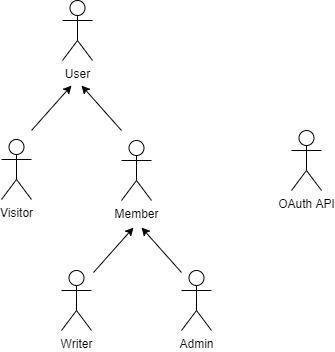
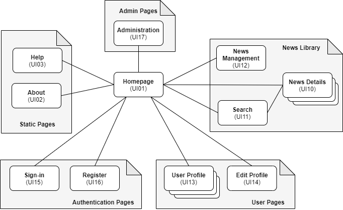
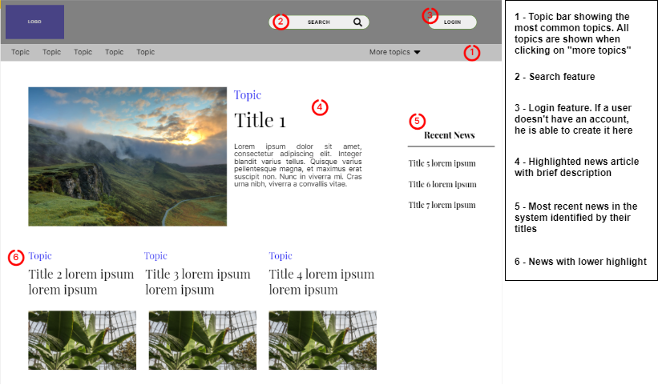
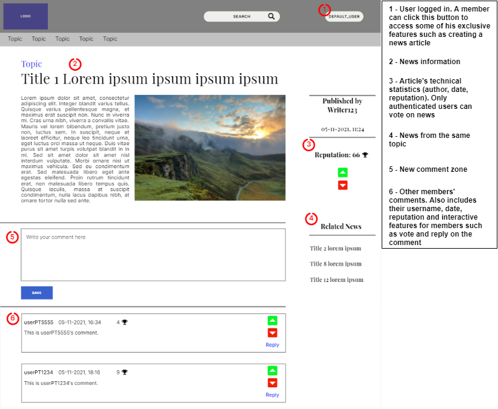
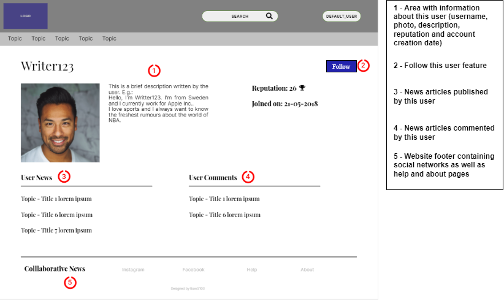

# ER: Requirements Specification Component

Collaborative News is a web platform for news sharing where you can also interact with other users.

## A1: Collaborative News
The main focus of the project "Collaborative News" is to develop a website and information system that is able to manage the sharing of news from different users, as well as their profiles. 
This tool is set to be used by those who want to share fresh news and people who seek to be up to date. 

We increasingly live in a world where people want to keep up with reality. The purpose of this project is to gather news in just one big useful community so that our users don´t have to search in multiple other websites for the accurate information they look for.

Users may create an account and sign-in, becoming members. 
Members can create, edit and delete their news and comments and vote on other authenticated users' posts, as well as visit others' profiles and edit their own. 
Each news article has a topic. When creating a news, members can choose from already approved topics or suggest new ones. 
On the other hand, the administrators can control every post and approve the topics. 
Admins can also permanently ban users. Members that create news or comments are considered writers. 
Users that don't sign-in are considered visitors and can still view news and comments.

User's reputation is presented in their profiles, and it depends on the votes received on their posts or comments. News and comments reputation also work in the same way. 
The presented news can be sorted according to their votes and/or how recently they were posted, and can be filtered according to their topic or specific search.

Users can follow each other through user profiles. They will also receive notifications regarding their news and comments.
A post or comment cannot be deleted by its author if it already has votes or comments.

***

## A2: Actors and User stories
This artifact contains the documentation about the actors and their respective user stories. It also includes the supplementary requirements: business rules, technical requirements and restrictions to the system.

### 1. Actors

Figure 1: Collaborative News actors.

|Identifier|Description|
|:---:|:---:|
| User | Generic user that has access to public information, such as news articles and member's profiles |
| Visitor | Unauthenticated user that can register itself (sign-up) or login (sign-in) in the system |
| Member | Authenticated user that can access public information and interact with it (post, comment, vote, follow other members) |
| Writer | Author of news item or comment that can edit and delete them |
| Admin | Authenticated user that is responsible for the management of content, user´s accounts, topic proposals and user reports |
| OAuth API | External OAuth API that can be used to register or authenticate into the system (Google) |

Table 1: Collaborative News actors description.

### 2. User Stories

#### 2.1 Visitor

| Identifier | Name | Priority | Description |
|:----------:|:------:|:------:|:------:|
| US01 | Sign-up | High | As a Visitor, I want to sign-up so I can become a Member |
| US02 | Sign-in | High | As a Visitor, I want to sign-in to access my Member features |
| US03 | Recover password | Low | As a Visitor, I want to recover my password, so that I can access my account again |
| US04 | OAuth API Sign-up | Low | As a Visitor, I want to register a new account linked to my Google account, so that I do not need to create a whole new account to use the platform |
| US05 | OAuth API Sign-in | Low | As a Visitor, I want to sign-in through my Google account, so that I can authenticate myself into the system |

Table 2: Visitor user stories.

#### 2.2 User

| Identifier | Name | Priority | Description |
|:----:|:--------:|:------:|:----------------:|
| US06 | View news item | High | As a User, I want to view specific news item, so that I can access more information |
| US07 | View news item comments | High | As a User, I want to view news item comments, so that I can view what people are saying about that topic |
| US08 | Search by topic | High | As a User, I want to search using multiple attributes, so that I can select the topic of news I want to see |
| US09 | Search for news items and comments | High | As a User, I want to search for specific posts, so that I can access what I’m looking for |
| US10 | See About | High | As a User, I want to see the about page, so that I can get to know who developed the site |
| US11 | See Help | High | As a User, I want to see the help page, so that I can be able to report bugs or ask questions |
| US12 | Exact match search | Low | As a User, I want to search for specific posts, so that I can access what I’m looking for faster |
| US13 | Search using filters | Low | As a User, I want to search using filters, so that I can filter the news I'm looking for |
| US38 | View Top News Feed | High | As a User, I want to view top news feed, so that I can see the trending and recent news on the feed |

Table 3: User user stories.

#### 2.3 Member

| Identifier | Name | Priority | Description |
|:----:|:--------:|:------:|:----------------:|
| US14 | Edit profile | High | As a Member, I want to edit my profile, so that I can present myself to other Members |
| US15 | View own profile | High | As a Member, I want to view my own profile, so that I can get to know how it looks like and see my reputation |
| US16 | View others users' profiles | High | As a Member, I want to view others Member's profiles, so that I can see their information and reputation |
| US17 | Logout | High | As a Member, I want to logout, so that other users can authenticate |
| US18 | Delete account | High | As a Member, I want to delete my account, so that I'm no longer related to the news and comments I posted as I'm no longer interested in being part of this system |
| US19 | Create news item | High | As a Member, I want to create a news item, so that I can share it with other people |
| US20 | Comment on news item | High | As a Member, I want to comment on any news items, so that I can share my opinion about that item |
| US21 | Vote on news item | High | As a Member, I want to upvote or downvote news, so that I can show what news I like to see and give feedback to Writers |
| US22 | Vote on comment | High | As a Member, I want to upvote or downvote comments, so that I can show my opinion on a comment |
| US23 | Propose new topic | Medium | As a Member, I want to propose a new topic, so that news can be better organized in categories |
| US24 | Follow topics | Medium | As a Member, I want to follow a topic, so that I can see its news items on my feed |
| US25 | Unfollow topics | Medium | As a Member, I want to unfollow a topic, so that I no longer have to see its news items on my feed |
| US26 | Follow member | Medium | As a Member, I want to follow a member, so that I can see his posts on my feed |
| US27 | Unfollow member | Medium | As a Member, I want to unfollow a member, so that I no longer have to see his posts on my feed |
| US39 | View User News Feed | High | As a Member, I want to view my news feed, so that I can see the news suggest to me on the feed |

Table 4: Member user stories.

#### 2.4 Writer

| Identifier | Name | Priority | Description |
|:----:|:--------:|:------:|:----------------:|
| US28 | Edit news item | High | As a Writer, I want to edit my own news item, so that I keep them updated  |
| US29 | Delete news item | High | As a Writer, I want delete my own news items, so that I’m not sharing wrong information |
| US30 | Edit comment | High | As a Writer, I want to edit my own comment, so that I keep it updated  |
| US31 | Delete comment | High | As a Writer, I want delete my own comment, so that I’m not sharing wrong information |
| US32 | See notifications | Low | As a Writer, I want see my notifications, so that I’m always aware of the votes and comments on my posts, knowing my reputation depends on them |

Table 5: Writer user stories.

#### 2.5 Admin

| Identifier | Name | Priority | Description |
|:----:|:--------:|:------:|:----------------:|
| US33 | Delete user accounts | High | As an Admin, I want to remove a user from the system, so that he can no longer access restricted content |
| US34 | Manage content | High | As an Admin, I want to edit or delete news items and comments, so that the system doesn't have inappropriate or wrong content |
| US35 | Block user accounts | Medium | As an Admin, I want to block a user with low reputation, so that he can no longer access restricted content for a specific period of time |
| US36 | Unblock user accounts | Medium | As an Admin, I want to unblock a user, so that he can now access restricted content again |
| US37 | Manage topic proposals | Medium | As an Admin, I want to approve or decline a new topic proposal, so that it will be added or not to the list of topics |
| US40 | Administer User Accounts | Medium | As an Admin, I want to administer user accounts, so that I can search, view, edit, create and delete user accounts |

Table 6: Admin user stories.

### 3. Supplementary Requirements

#### 3.1. Business rules

| Identifier | Name | Description |
|:----:|:--------:|:----------------:|
| BR01 | Account deletion | When user account is deleted, shared user data (news items, comments and votes) is kept but is made anonymous |
| BR02 | User reputation | User reputation depends on the upvotes and downvotes received on his posts or comments |
| BR03 | Data consistency | A post or comment cannot be deleted by its author if it has votes or comments |
| BR04 | Date | The date of a comment or a vote on a post must be greater than the item it refers to |
| BR05 | Interaction with own item | A user can´t vote on his own posts or comments but he can comment his own news items |

Table 7: Collaborative News business rules.

#### 3.2. Technical requirements

| Identifier | Name | Description |
|:----:|:-----------:|:--------------:|
| **TR01** | **Availability** | **The system must be available 99 percent of the time in each 24-hour period. The main focus of the system is to keep people up to date, so the system has to be available all the time as every second counts on the world of news sharing.** |
| TR02 | Accessibility | The system must ensure that everyone can access the pages, regardless of whether they have any handicap or not, or the web browser they use |
| **TR03** | **Usability** | **The system should be simple and easy to use. Considering news are an interest of the general population, people with no more than basic knowledge of using the internet should be able to take advantage of all the system's features.** |
| TR04 | Performance | The system should have response times shorter than 2 s to ensure the user's attention |
| TR05 | Web application | The system should be implemented as a Web application with dynamic pages (HTML5, JavaScript, CSS3 and PHP) |
| **TR06** | **Portability** | **The server-side system should work across multiple platforms (Linux, Mac OS, etc.). As people want to access the system no matter where they are, it is important that the website works not only on PC but also on their mobile phones and tablets.** |
| TR07 | Database | The PostgreSQL database management system must be used, with a version of 11 or higher |
| TR08 | Security | The system shall protect information from unauthorised access through the use of an authentication and verification system |
| TR09 | Robustness | The system must be prepared to handle and continue operating when runtime errors occur |
| TR10 | Scalability | The system must be prepared to deal with the growth in the number of users and their actions |
| TR11 | Ethics | The system must respect the ethical principles in software development (for example, personal user details, or usage data, should not be collected nor shared without full acknowledgement and authorization from its owner) |

Table 8: Collaborative News technical requirements.

#### 3.3. Restrictions

| Identifier | Name | Description |
|:----------:|:------:|:------:|
| C01 | Deadline | The system should be ready to be used by the end of January |

Table 9: Collaborative News project restrictions.

***

## A3: Information Architecture
This artefact enables a brief exploration of the information architecture of the system to be developed, in particular the identification of the content, how it is organized and made available, and how it is presented. 
It includes a **sitemap**, presenting the overall structure of the web application, and a set of **wireframes**, defining how space is allocated and how content is prioritized.

### 1. Sitemap
The Collaborative News system is organized in five main areas, the static pages that provide general information about the system (Static Pages),
 the pages used to search (search by topic, string or apply filters), access (view details) and create the news (News Library),
 the members' profile pages, used to view and edit information about each member of the platform (User Pages),
 the authentication pages for signing-in and signing-up (Authentication Pages), and
 the pages with administration features (Admin Pages).

Figure 2: Collaborative News sitemap.

### 2. Wireframes
Below are the wireframes for the **homepage** (UI01), the **news details page** (UI10) and the **user profile page** (UI13), presented in Figures 3, 4 and 5, respectively.

Figure 3: Homepage (UI01) wireframe.

Figure 4: News Details (UI10) wireframe.

Figure 5: User Profile (UI13) wireframe.

***

## Revision history

Changes made to the first submission:

1. A1: removed friendship mentions
2. User Stories: US26 - changed from "Establish friendship" to "Follow member"
3. User Stories: US27 - changed from "Remove friendship" to "Unfollow member"
4. Wireframes: UI13 - changed "Add friend" button to "Follow"
5. Added US38, US39 and US40

***

GROUP2103, 22/12/2021

* Diogo Pinto, up201906067@up.pt
* Guilherme Garrido, up201905407@up.pt (Editor)
* Luís Lucas, up201904624@up.pt
* Pedro Pinheiro, up201906788@up.pt