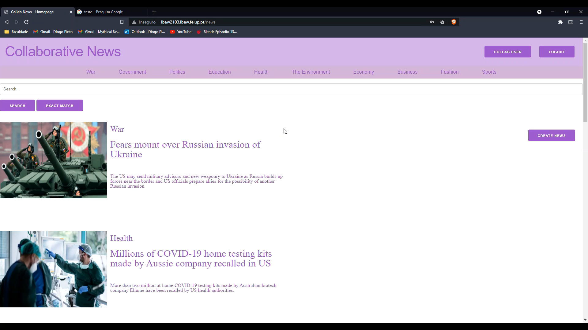

# PA: Product and Presentation

Collaborative News is a web platform for news sharing where you can also interact with other users.

## A9: Product

The main focus of this project was to develop a system for news sharing where users can interact with posts and other users.

The website has a simple design that allows users to easily navigate through pages and find what they are looking for. 
It gathers news from multiple topics so that users don´t need to search for them in multiple other websites.
The system is perfect for interactions with posts: simple and fast, inducing users to interact even more and increase the feedback on articles.

Authenticated users can create news and comment and vote on posts. Those interactions can be edited or deleted by the owner. 
Members can also check on other users profiles as well as manage their own.
They have a page specifically made for them, full of articles they might like based on their interaction with the system.

By managing all the content, the admin, with an help from reputation system implemented, allows users a safer experience in the website.


### 1. Installation

The final version of the source code is available [here](https://git.fe.up.pt/lbaw/lbaw2122/lbaw2103/-/tree/PA). 

Docker commands to start the image:

```
docker run -it -p 8000:80 --name=lbaw2103 -e DB_DATABASE="lbaw2103" -e DB_SCHEMA="lbaw2103" -e DB_USERNAME="lbaw2103" -e DB_PASSWORD="DIgnbUzo" git.fe.up.pt:5050/lbaw/lbaw2122/lbaw2103
```

### 2. Usage

The URL to the product is: http://lbaw2103.lbaw.fe.up.pt  

#### 2.1. Administration Credentials

Administration URL: http://lbaw2103.lbaw.fe.up.pt/admin/users 

| Username | Password |
| -------- | -------- |
| admin@fe.up.pt    | admin123 |

#### 2.2. User Credentials

| Type          | Username  | Password |
| ------------- | --------- | -------- |
| basic account | collab@fe.up.pt    | collab123 |
| news writer/editor   | newseditor@fe.up.pt    | newsed123 |

### 3. Application Help

A static [Help](http://lbaw2103.lbaw.fe.up.pt/help) page (available in the footer) is provided to help our users interact with the website. 
In addition, forms show error messages to help them when they try to submit invalid information.
For example, if you try to create an account with a username already taken, a message "*The name has already been taken*" will show up. 

### 4. Input Validation

Input data is validated in both client-side and server-side. 
For example, as client-side validation, on user registration, the e-mail field is verified to check if it really corresponds to an e-mail type string (has a '@').
An example for server-side validation is when a user tries to create an account with a username already taken and the server returns an error message and ignores the request.

### 5. Check Accessibility and Usability

[**Accessibility**](accessibility.pdf)

* There is no need to use fieldsets in our forms as they specify a single model, in which information cannot be grouped.

[**Usability**](usability.pdf)

* There was no time left to fully complete some points such as mobile usability, user location feedback, CSS features and handling some errors.

### 6. HTML & CSS Validation

[**HTML validation**](html_validation.pdf)

[**CSS validation**](css_validation.pdf)

### 7. Revisions to the Project

Since the requirements specification stage, three user stories were added (US38, US39 and US40) to clarify some features included in the product.
In the OpenApi, a missing resource was added (R114), and some were reviewed and updated to match the final product.
On the other hand, some low priority features weren´t implemented in the final product, but they do not interfere in its correct flow.

### 8. Implementation Details

#### 8.1. Libraries Used

For this project, the [Laravel](https://laravel.com/) framework was used in the product. No libraries were used.

#### 8.2 User Stories

| US Identifier | Name    | Module | Priority                       | Team Members               | State  |
| ------------- | ------- | ------ | ------------------------------ | -------------------------- | ------ |
| US01 | Sign-up 							| M01 | High   | **Diogo Pinto** | 100% |
| US02 | Sign-in 							| M01 | High   | **Pedro Pinheiro** | 100% |
| US17 | Logout 							| M01 | High   | **Diogo Pinto** | 100% |
| US06 | View news item 					| M02 | High   | **Luís Lucas** | 100% |
| US38 | View Top News Feed 				| M02 | High   | **Luís Lucas** | 100% |
| US19 | Create news item 					| M02 | High   | **Luís Lucas** | 100% |
| US28 | Edit news item 					| M02 | High   | **Luís Lucas** | 100% |
| US29 | Delete news item 					| M02 | High   | **Luís Lucas** | 100% |
| US15 | View own profile 					| M01 | High   | **Pedro Pinheiro** | 100% |
| US16 | View others users' profiles 		| M01 | High   | **Pedro Pinheiro** | 100% |
| US14 | Edit profile 						| M01 | High   | **Pedro Pinheiro** | 100% |
| US40 | Administer User Accounts 			| M04 | Medium | **Guilherme Garrido** | 100% |
| US34 | Manage content 					| M04 | High   | **Guilherme Garrido** | 100% |
| US09 | Search for news items and comments | M03 | High   | **Luís Lucas** | 100% |
| US12 | Exact match search 				| M03 | Low    | **Luís Lucas** | 100% |
| US10 | See About 							| M04 | High   | **Diogo Pinto** | 100% |
| US11 | See Help 							| M04 | High   | **Diogo Pinto** | 100% |
| US18 | Delete account 					| M01 | High   | **Guilherme Garrido** | 100% |
| US33 | Delete user accounts 				| M04 | High   | **Guilherme Garrido** | 100% |
| US08 | Search by topic 					| M03 | High   | **Guilherme Garrido** | 100% |
| US24 | Follow topics 						| M03 | Medium | **Pedro Pinheiro** | 100% |
| US25 | Unfollow topics 					| M03 | Medium | **Pedro Pinheiro** | 100% |
| US26 | Follow member 						| M01 | Medium | **Pedro Pinheiro** | 100% |
| US27 | Unfollow member 					| M01 | Medium | **Pedro Pinheiro** | 100% |
| US07 | View news item comments 			| M02 | High   | **Diogo Pinto** | 100% |
| US20 | Comment on news item 				| M02 | High   | **Guilherme Garrido** | 100% |
| US30 | Edit comment 						| M02 | High   | **Diogo Pinto** | 100% |
| US31 | Delete comment 					| M02 | High   | **Diogo Pinto** | 100% |
| US21 | Vote on news item 					| M02 | High   | **Guilherme Garrido** | 100% |
| US22 | Vote on comment 					| M02 | High   | **Guilherme Garrido** | 100% |
| US39 | View User News Feed 				| M02 | High   | **Luís Lucas** | 100% |


---


## A10: Presentation

### 1. Product presentation 

Collaborative News is a web system able to manage the sharing of news from different users. 
This tool allows users to easily interact with posts by commenting and voting on them.

Users can filter articles by topics or by text-searching them. 
User profiles show information about the user's activity on the website.
From their own profile, members can access a suggestion page specifically made for them, based on their interaction with the system.

URL to the product: http://lbaw2103.lbaw.fe.up.pt  


### 2. Video presentation



Links to the video:

* [Git](lbaw2103.mp4)
* [Google Drive](https://drive.google.com/file/d/1LDHISs9PSixVVdBXJwVu7J3pUF67TMrq/view?usp=sharing)


---


## Revision history

Changes made to ER, EBD and EAP are documented in the respective documents.

***
GROUP2103, 28/01/2022

* Diogo Pinto, up201906067@up.pt (Editor)
* Guilherme Garrido, up201905407@up.pt
* Luís Lucas, up201904624@up.pt
* Pedro Pinheiro, up201906788@up.pt
